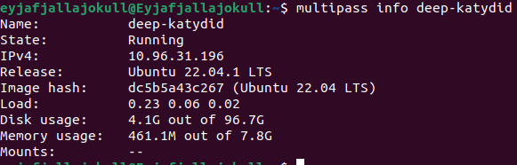
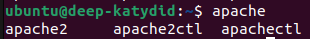
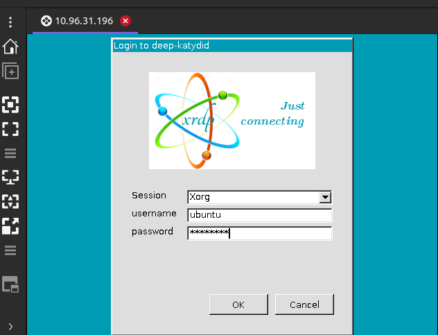
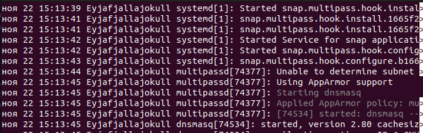
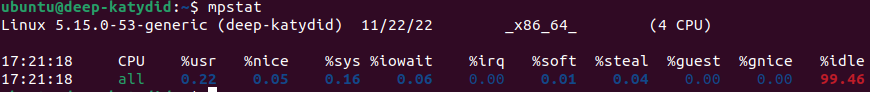
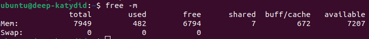

# Lab 4

## Task 1

### 1

- Create an instance - [src](https://multipass.run/docs/create-an-instance#heading--create-an-instance-with-custom-cpu-number-disk-and-ram)



### 2

- Install Apache server - [src](https://jonathanbossenger.com/2022/05/25/configuring-ubuntu-in-multipass-for-local-web-development-on-a-macbook/)



### 3

- Install `remmina` and [remmina-plugin-rdp](https://remmina.org/how-to-install-remmina/)

- Set up GUI - [src](https://multipass.run/docs/set-up-a-graphical-interface#heading--rdp-on-linux)



### 4

- Access logs - [src](https://multipass.run/docs/accessing-logs)



## Task 2

- Cpu usage - [src](https://www.cyberciti.biz/faq/linux-command-to-see-major-minor-pagefaults/)



- Page faults - [src](https://www.cyberciti.biz/faq/linux-command-to-see-major-minor-pagefaults/)

```sh
ubuntu@deep-katydid:~$ ps -o min_flt,maj_flt 1
 MINFL  MAJFL
 18485    148
```

- Memory swaps - [src](https://www.cyberciti.biz/faq/linux-check-swap-usage-command/)



### Sysbench

[Table](https://docs.google.com/document/d/1Uc-B9dd1aAswS_CDVn8P4VOUbjuE2vD9jBLv8W9lQY0/edit?usp=sharing)

Bench 5 tried several times, but it did not succeed
