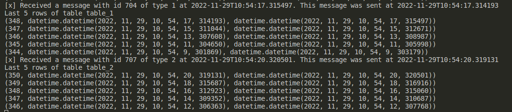

# Lab 5

## Prerequisites

- [Install Nix](https://github.com/deemp/flakes/blob/main/README/NixPrerequisites.md#install-nix)

## Commands

1. Enter a directory

```sh
git clone https://github.com/deemp/tv
cd tv/lab5
nix develop
cd src
```

1. Start using `docker`

```sh
docker compose up
```

1. Start cluster

```sh
cd k8s
minikube start
kubectl apply -Rf .
kubectl get po
# here, put your NAME
kubectl logs -f consumer-deployment-d79646798-jgrmg
```

1. It may take some time for a consumer to connect to the DB

1. Consumer logs contents:
   - Notification about a message received from the queue
   - Contents of a table in a `PostgreSQL` database

1. A sample of a log

    

## Other used commands

1. `kubectl rollout restart deployment/producer-deployment`
1. `kubectl get all`
1. `kubectl delete pod producer-deployment-854855fbb-2vvmn`
1. `kubectl describe pod consumer-deployment-778ffb9d45-2tv6k`
1. `docker compose down --volumes`
   1. Remove previous database contents

## References

- PostgreSQL in Docker - [src](https://towardsdatascience.com/how-to-run-postgresql-and-pgadmin-using-docker-3a6a8ae918b5)
- Check PostgreSQL is running - [SO](https://stackoverflow.com/a/48648959)
- Docker volumes - [src](https://github.com/docker-library/rabbitmq/issues/530#issuecomment-1012985283)
  - To avoid access permission problems
- Recreate volumes - [SO](https://stackoverflow.com/a/67971684)
  - To re-initialize a DB
- A `Python` single-element tuple should have a comma like in `(a,)`
  - This is necessary when passing records via `psycopg2` - [src](https://www.psycopg.org/docs/usage.html#passing-parameters-to-sql-queries)
  - It's safer to use lists
- Added `PostgreSQL` by following the second part of this [tutorial](https://phoenixnap.com/kb/postgresql-kubernetes)
- Specify a Docker user and group - [src](https://dev.to/acro5piano/specifying-user-and-group-in-docker-i2e)
