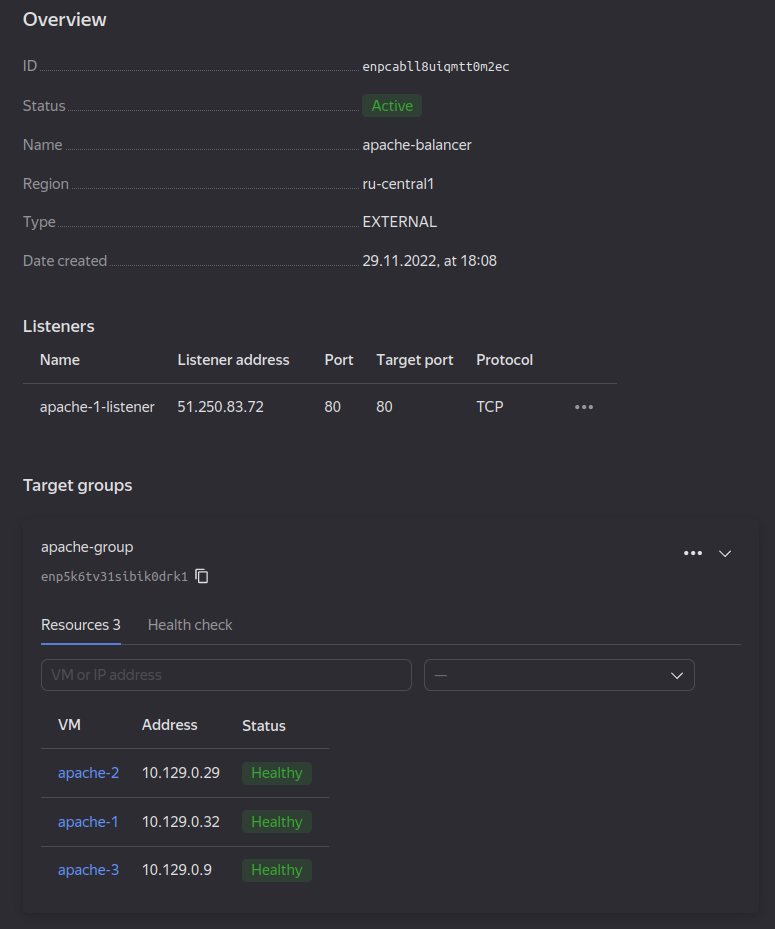
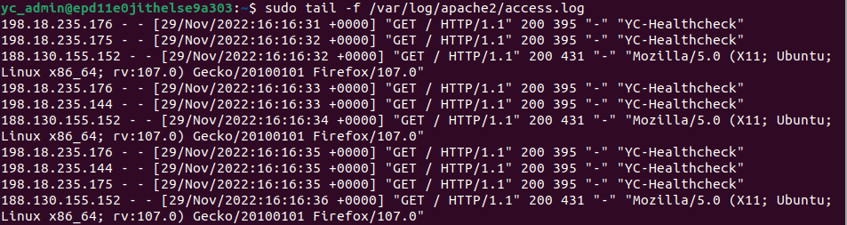
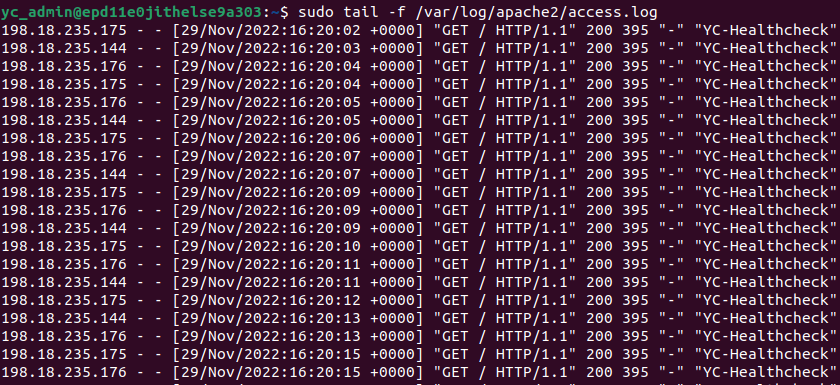
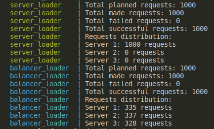

# Lab 6

## Steps

1. Created a pair of SSH keys
1. Used `Yandex Cloud`'s GUI to create an Ubuntu VM
1. Connected via `SSH` to this instance and installed an `apache2` server
1. Created an `html` file as per `Part A, 4`
1. Created an image of my instance and 2 other instances from this image
1. Logged into other instances and edited `html`s in them
1. Created a `listener`, created a `target group`, created a `Network Load Balancer`
1. Opened the page of my load balancer in a browser

    

1. Opened a page served by this cluster

    

1. A log with the `load balancer` routing to `VM1`
    

1. A log with the `load balancer` not routing requests to `VM1`
   

### 12

I didn't find a way to change the weights or the algorithm of a load balancer in `Yandex Cloud`.
What I did observe was that my 3 VMs change once in a couple of minutes in a round-robin manner during manual testing (reloading a page by hand).

### Part C

I put the load producers into Docker containers. One of them will send the requests to a single server. Another one will request by the load balancer's address. They can both be run as follows

```console
cd lab6
nix develop
docker compose build
docker compose up
```

The requests stats are as follows:



Here, in both cases, there are no failed requests.

When a load balancer is enabled, the requests are distributed evenly.
