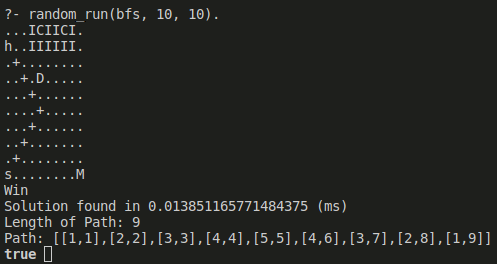

# Intro2AI [S21] course assignment

## Description

The goal is to find an optimal path in a maze.

* Full problem [statement](./Statement.pdf).

* Here's how a run looks like



* I used the cartesian coordinates

* Meaning of letters
  * `h` - home
  * `D` - doctor
  * `s` - start
  * `I` - infected cells
  * `C` - Covid

## Run

* [Install](https://wwu-pi.github.io/tutorials/lectures/lsp/010_install_swi_prolog.html) SWI-Prolog
  * Alternatively, use a devshell from this flake

    ```console
    nix develop
    ```

* Run

  ```sh
  swipl game.pl
  ```

* And then

  ```sh
  random_run(bfs, 10, 10).
  ```
