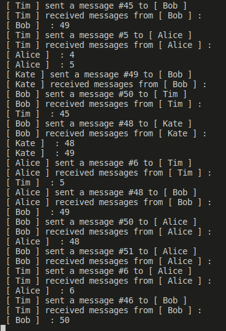

# simplex-cheat

It's a `simplex-chat`-like app, but much simpler. There's a `server` and a `spawner` that spawns `user`s following a [config](./data/configs/contacts.yaml) so that `user`s talk to each other concurrently.

## Prerequisites

These might be useful if you'd like to learn `Nix` and my flakes:

- [Prerequisites](https://github.com/deemp/flakes#prerequisites)
- [Haskell](https://github.com/deemp/flakes/blob/main/README/Haskell.md)
- [Troubleshooting](https://github.com/deemp/flakes/blob/main/README/Troubleshooting.md) - see in case of problems with `VSCodium`, etc.

## Quick start

1. Install Nix - see [how](https://github.com/deemp/flakes/blob/main/README/InstallNix.md).

1. Start a devshell and run app

    ```console
    nix develop
    cabal run
    ```

1. Here's a sample log:



## Contribute

1. Start a devshell and open `VSCodium`

    ```console
    nix develop
    write-settings-json
    codium .
    ```

1. Open a `Haskell` file and wait until `HLS` starts giving you type hints

## References

- [Servant: Custom monad](https://docs.servant.dev/en/stable/cookbook/using-custom-monad/UsingCustomMonad.html)
- [The ReaderT Design Pattern](https://www.fpcomplete.com/blog/2017/06/readert-design-pattern/)
- [Practical STM: An Async Job Queue, by Jake Keuhlen](https://www.youtube.com/watch?v=KAlSoytmVFA)

  - `TMVar` - don't forget to put a value inside
  - `stdout` is a shared resource - can put log into a `TVar`
